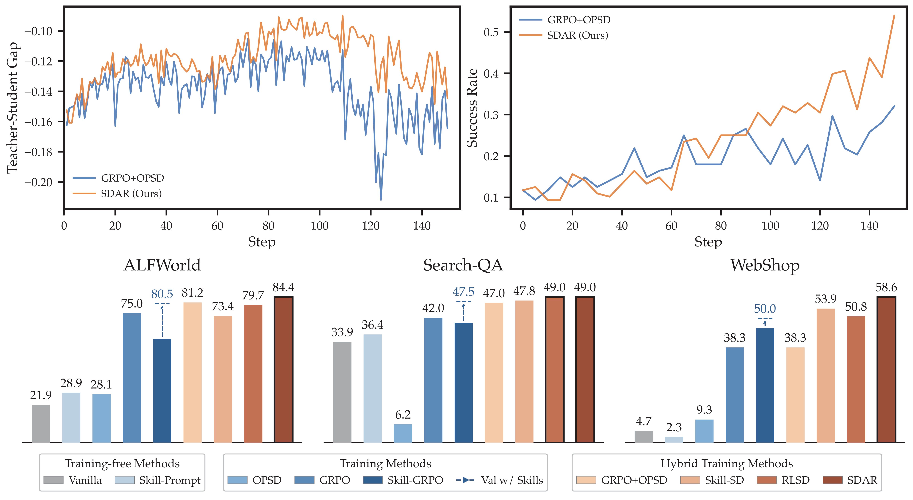
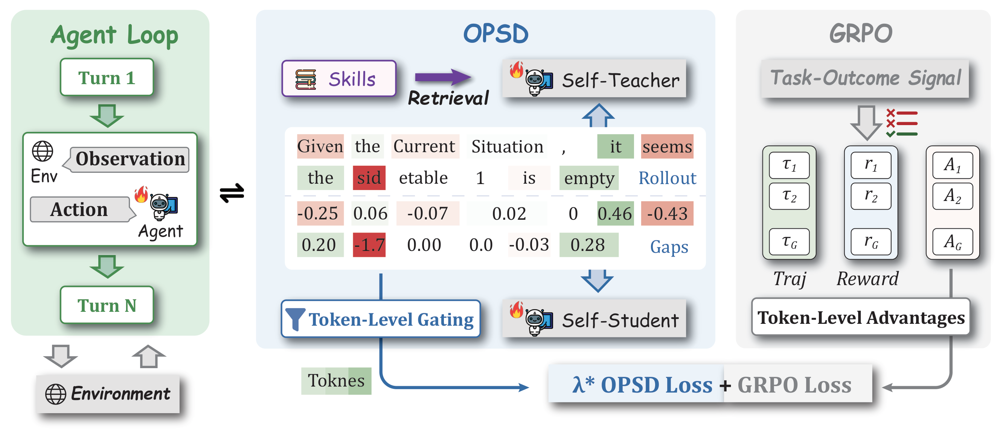
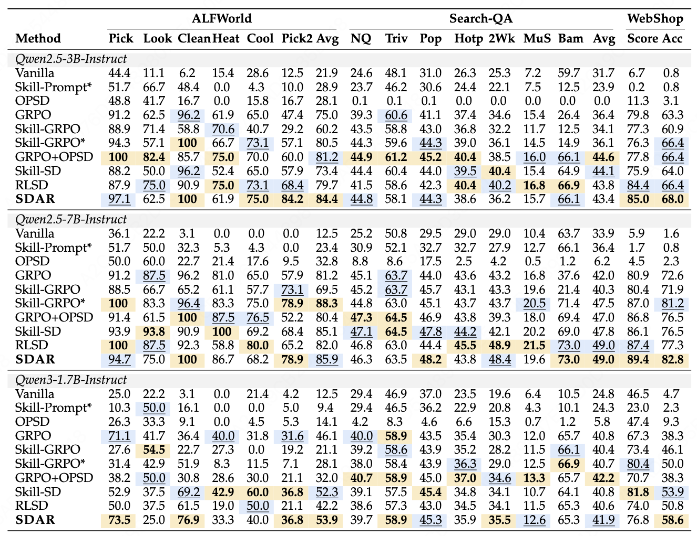

<h1 align="center">
Self-Distilled Agentic Reinforcement Learning
</h1>
<div align='center' style="font-size:18px;">
<p>
    <a href="https://arxiv.org/abs/2605.15155">
      
    </a>
    <a href="https://huggingface.co/papers/2605.15155">
      
    </a>
  </p>
</div>


## 🔥 Overview

We introduce **SDAR**, a Self-Distilled Agentic Reinforcement learning method.
<div align="center" style="display:flex; justify-content:center; gap:20px; align-items:flex-start;">
  
  
</div>


SDAR achieves substantial improvements over the standard RL baseline on ALFWorld, WebShop, and Search-QA.
<div align="center">
  
</div>

## 🗞️ News
- **`2026-5-15`**: 🔥 We released our paper and code.

## 🛠️ Installation


### Python environment

```bash
conda create -n skillzero python==3.12 -y
conda activate skillzero

pip3 install vllm==0.11.0

pip3 install flash-attn==2.7.4.post1 --no-build-isolation --no-cache-dir
pip install -e .
```

Log in to Weights & Biases if you use WandB logging (scripts pass `trainer.logger=['console','wandb']` in many cases):

```bash
export WANDB_API_KEY=your_key_here
```

### Install Supported Environments

#### 1. ALFWorld
Install with pip:
```bash
pip3 install gymnasium==0.29.1
pip3 install stable-baselines3==2.6.0
pip3 install alfworld
```

Download PDDL & Game files and pre-trained MaskRCNN detector (will be stored in `~/.cache/alfworld/`):
```bash
alfworld-download -f
```

#### 2. WebShop
WebShop requires Python <=3.10, so begin by creating a new environment:
```bash
conda create -n verl-webshop python==3.10 -y
conda activate verl-webshop
```

Install WebShop:
```bash
cd ./agent_system/environments/env_package/webshop/webshop
./setup.sh -d all
```

After WebShop is installed, return to the root directory and install the verl package:
```bash
cd repo_root/
pip3 install torch==2.6.0 --index-url https://download.pytorch.org/whl/cu124
pip3 install flash-attn==2.7.4.post1 --no-build-isolation
pip3 install -e .
pip3 install vllm==0.8.2
# spacy 3.7.2 requires typer<0.10.0,>=0.3.0, but you have typer 0.15.2 which is incompatible.
# weasel 0.3.4 requires typer<0.10.0,>=0.3.0, but you have typer 0.15.2 which is incompatible.
```
The warnings can be safely ignored.

#### 3. Search
```bash
cd ./agent_system/environments/env_package/search/third_party
pip install -e .
pip install gym==0.26.2
```

Prepare dataset (data will be saved at `~/data/searchR1_processed_direct`):
```bash
cd repo_root/
python examples/data_preprocess/preprocess_search_r1_dataset.py
```


Since faiss-gpu is not available via pip, we setup a separate conda environment for the local retrieval server. Running this server will use around 6GB of GPU memory per GPU, so make sure to account for this in your training run configuration. Build Retriever environments:
```bash
# Create and activate the retriever environment with Python 3.10
conda create -n retriever python=3.10 -y
conda activate retriever

# Install PyTorch (with GPU support) and related libraries
conda install numpy==1.26.4 # needed to stop incompatible version of numpy from being installed via pip
pip install torch==2.6.0 torchvision==0.21.0 torchaudio==2.6.0 --index-url https://download.pytorch.org/whl/cu124

# Install other Python packages
pip install transformers datasets pyserini huggingface_hub

# Install the GPU version of faiss
conda install faiss-gpu==1.8.0 -c pytorch -c nvidia -y

# Install the API service framework
pip install uvicorn fastapi
```

Download the index:
```bash
conda activate retriever

local_dir=~/data/searchR1
python examples/search/searchr1_download.py --local_dir $local_dir
cat $local_dir/part_* > $local_dir/e5_Flat.index
gzip -d $local_dir/wiki-18.jsonl.gz
```

Start the local flat e5 retrieval server: 
```bash
conda activate retriever

# redirect the output to a file to avoid cluttering the terminal
# we have observed outputting to the terminal causing spikes in server response times
bash examples/search/retriever/retrieval_launch.sh > retrieval_server.log 
```


### Training

All scripts live under `examples/` and assume the repo root as working directory. You can run e.g.:

```bash
bash examples/sdar_trainer/run_alfworld_3b.sh
bash examples/sdar_trainer/run_search_3b.sh
bash examples/sdar_trainer/run_webshop_3b.sh
```

### Merge checkpoints

See `scripts/model_merger.py` for FSDP/Megatron merge examples using paths under `./checkpoints/...`.

## ⭐️ Citation

If you find this project useful, welcome to cite us.

```bibtex
@misc{lu2026sdar,
      title={Self-Distilled Agentic Reinforcement Learning}, 
      author={Zhengxi Lu and Zhiyuan Yao and Zhuowen Han and Zi-Han Wang and Jinyang Wu and Qi Gu and Xunliang Cai and Weiming Lu and Jun Xiao and Yueting Zhuang and Yongliang Shen},
      year={2026},
      eprint={2605.15155},
      archivePrefix={arXiv},
      primaryClass={cs.LG},
      url={https://arxiv.org/abs/2605.15155}, 
}
@misc{lu2026skill0,
      title={SKILL0: In-Context Agentic Reinforcement Learning for Skill Internalization}, 
      author={Zhengxi Lu and Zhiyuan Yao and Jinyang Wu and Chengcheng Han and Qi Gu and Xunliang Cai and Weiming Lu and Jun Xiao and Yueting Zhuang and Yongliang Shen},
      year={2026},
      eprint={2604.02268},
      archivePrefix={arXiv},
      primaryClass={cs.LG},
      url={https://arxiv.org/abs/2604.02268}, 
}
@misc{shi2026skill1,
      title={Skill1: Unified Evolution of Skill-Augmented Agents via Reinforcement Learning}, 
      author={Yaorui Shi and Yuxin Chen and Zhengxi Lu and Yuchun Miao and Shugui Liu and Qi GU and Xunliang Cai and Xiang Wang and An Zhang},
      year={2026},
      eprint={2605.06130},
      archivePrefix={arXiv},
      primaryClass={cs.AI},
      url={https://arxiv.org/abs/2605.06130}, 
}
```

## 🤝 Acknowledgement

This project builds on [verl-agent](https://github.com/langfengQ/verl-agent), [veRL](https://github.com/volcengine/verl), [ALFWorld](https://github.com/alfworld/alfworld), [SkillRL](https://github.com/aiming-lab/SkillRL), and [Search-R1](https://github.com/PeterGriffinJin/Search-R1). We thank the authors of those projects.
